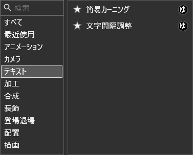
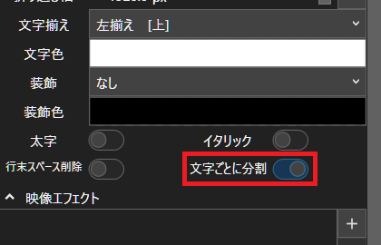
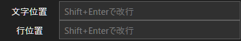
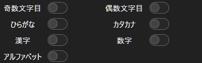
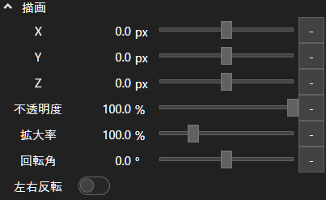
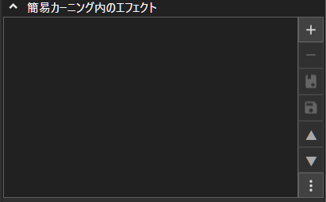
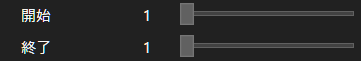

# 簡易カーニング-YMM4プラグイン

## 概要
テキストの描画位置や拡大率などを文字ごとに調整する映像エフェクトプラグインです。  
また、文字ごとに映像エフェクトをかける機能を提供します。

## 導入方法
> [!IMPORTANT]
> **通常のプラグインと導入方法が異なります。**  
> **必ず下の1~6の手順で導入を行ってください。**

1. https://github.com/tetra-te/Harmony4YMM4/releases/latest にアクセスする。
2. `Harmony4YMM4_X.X.X.ymme`をクリックしてダウンロードする。
3. [Releases](https://github.com/tetra-te/SimpleKerningEffect/releases/latest)にアクセスする。
4. `SimpleKerningEffect_vX.X.ymme`をクリックしてダウンロードする。
5. `Harmony4YMM4_X.X.X.ymme`をダブルクリックして開き、表示される画面の通りにインストールする。
6. `SimpleKerningEffect_vX.X.ymme`をダブルクリックして開き、表示される画面の通りにインストールする。

> [!NOTE]
> **ファイルをダブルクリックしてもインストールできない場合**  
> YMM4を起動して`ヘルプ(H)`>`YMM4用拡張子の関連付け`>`登録する`から拡張子の関連付けを行ってください。  
> 再度ファイルをダブルクリックすることでインストール画面が表示されます。

## 使用時の注意
* 2つの映像エフェクト **簡易カーニング**, **文字間隔調整** が追加されます。
* 追加される映像エフェクトはテキストアイテムに適用してください。
* 映像エフェクトは**テキスト**カテゴリに追加されます。  

> [!IMPORTANT]
> プラグインの動作には文字ごとに分割が必要です。  
> テキストアイテムの文字ごとに分割を必ず有効にしてください。
> 
> 

## 簡易カーニングエフェクト
指定した文字の描画位置や拡大率を変更したり、映像エフェクトを付与したりできます。  
各パラメーターの使い方は以下の通りです。

1. **文字位置・行位置**  
  
カーニング対象の文字・行を先頭から何文字目かの数字で指定します。  
`,`(カンマ)を用いた複数指定、`-`(ハイフン)を用いた範囲指定が可能です。  
また、`^`を数字の前につけると末尾から数えます。  
例えば1,2,5,6,7文字or行を対象にする場合は次のような指定が可能です。  
入力例：
`1,2,5,6,7`
`1,2,5-7`
`1-2,5-7`
  半角スペースは無視されます。  

2. **トグル**  
  
各トグルで対象に含める文字を指定できます。  

3. **対象文字**  
  
対象を直接文字で指定します。`,`(カンマ)で複数指定できます。  
入力例：
`いもけんぴ`
`柿の木,栗の木`  

4. **正規表現**  
  
対象を正規表現で指定します。  
入力例：`「[^「」]+」`  
この例を使用すると「」とその中身が対象になります。  

5. **描画**  
  
1~4のパラメーターで指定した文字を対象に、描画位置や回転角などのシンプルなエフェクトを適用します。  

6. **簡易カーニング内のエフェクト**  
  
1~4のパラメーターで指定した文字を対象に、縁取りや3D回転などのYMM4の映像エフェクトを適用します。

## 文字間隔調整エフェクト
文字の一部分を対象に文字間隔を調整できるエフェクトです。  
各パラメーターの使い方は以下の通りです。

1. **開始・終了**  
  
文字間隔を変更する範囲を指定します。  

3. **文字間隔**  
  
開始から終了までの範囲の文字間隔を調整します。  

4. **全体を調整**  
  
有効にすると範囲内の文字と範囲外の文字が重ならないように範囲外の文字の描画位置を調整します。  
デフォルトで有効です。  

5. **書字方向**  
  
文字を横書きとして扱うか縦書きとして扱うか指定します。  
通常利用では**自動**で問題ありません。

## アンインストール方法
1. YMM4を起動して、`ヘルプ(H)`>`その他`>`プラグインフォルダを開く`をクリックする。  
2. YMM4を終了する。
3. `SimpleKerningEffect`という名前のフォルダを削除する。

## 謝辞
文字ごとに映像エフェクトを付与する機能は[sinβ](https://x.com/sinBetaKun)(sinBetaKun)氏による実装です。  
これによりプラグインの自由度が大幅に向上しました。  
この場をお借りして、感謝申し上げます。

## ライセンス
このプラグインのライセンスは[CC0 1.0 Universal](/LICENSE)とします。

## 使用ライブラリ
このプラグインは[Harmony](https://github.com/pardeike/Harmony)を使用しています。  
HarmonyはMITライセンスのもとで配布されています。
